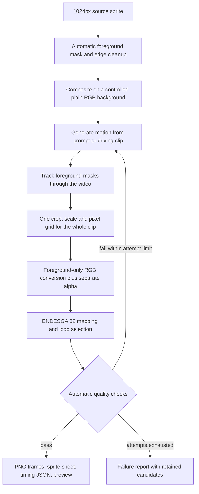

Research checked 2026-09-08. Scope: a local, fully automated path from the existing
dark-fantasy images to transparent, looping ENDESGA 32 sprite sheets.

The recommended first experiment is **BiRefNet foreground extraction → Wan 2.2
TI2V-5B image-to-video → temporally tracked masks → fixed-grid, fixed-palette
conversion → automatic loop selection and sheet export**. This is a proposed
pipeline, not a validated animation result. No animation or segmentation weights
were downloaded, and no new animations were generated during this research.
One local diagnostic was executed to verify Pyxelate's alpha behavior.

Background removal should happen before pixel conversion. Our existing lantern
comparison showed background texture becoming conspicuous after color reduction.
Eliminating those pixels should remove that background noise. It cannot repair
missing sword details, character deformation, source shading errors, or a bad
loop. This distinction matters for measuring whether masking actually helps.

The pinned Pyxelate 2.1.1 source has a concrete obstacle: `Pyx.fit()` computes a
foreground selection in its RGBA branch, then overwrites it with a resize of the
original, unmasked RGB. In the new diagnostic, 1,984 of 4,096 estimator input
samples matched the fully transparent background RGB, for both a magenta and a
cyan background behind the same visible red square. This tests data routing,
not an animation failure rate. The existing study separately observed visible
edge fringes changing with hidden RGB. See the
[diagnostic](metadata/pyxelate-alpha-fit-audit.json),
[pinned source](../pyxelate-study/vendor/pyxelate-f4a046b8b148370a20ab7681fce160551e5fc49b/pyxelate/pyx.py),
and [original alpha findings](../pyxelate-study/REPORT.md).

Therefore, feeding a transparent PNG directly into stock Pyxelate is insufficient.
Our current conservative wrapper also explicitly expects RGB; it needs a mask-aware
extension. The proposed implementation keeps a separate mask, decontaminates
edge colors, extends foreground colors into invisible pixels before filtering,
and resizes the mask separately on the same grid. It maps visible colors directly
to ENDESGA 32, then attaches the output alpha. This bypasses the problematic BGM
fit and the stock color-enhancement path. Nearest-neighbor plus the same mask and
palette remains the control. A premultiplied-alpha resampling control is useful
for checking edge bleed. All of these are proposed tests, not implemented fixes.

For strict pixel-art output, use binary alpha at the final resolution, while
retaining the original soft masks for processing. Compare nearest-neighbor mask
resizing with coverage/threshold resizing: thin swords, fingers, antlers and
lantern handles may vanish under an aggressive threshold. Do not automatically
fill every hole or delete every small disconnected component; some are valid
anatomy or effects. Flame/glow transparency needs separate treatment if soft
glows are desired. ENDESGA membership applies to foreground RGB; blending with
arbitrary game backgrounds naturally creates other displayed colors.

The model/tool shortlist is:

| Candidate | Verified capability | Assessment for this project |
|---|---|---|
| [Wan 2.2 TI2V-5B](https://github.com/Wan-Video/Wan2.2) through [native ComfyUI](https://docs.comfy.org/tutorials/video/wan/wan2_2) | Local image-to-video; published offloading workflows; Apache-2.0 model license. | First pilot for knight idle, lantern flame and wraith hover. Covers characters and objects without supplying a pose sequence. Pixel fidelity and loop closure are untested here. |
| [Wan-Animate-2 14B](https://huggingface.co/Wan-AI/Wan2.2-Animate-2-14B) | Released August 2026; transfers a driving video's movement without an intermediate pose extractor. Apache-2.0. The original setup is tested on multiple A800 GPUs. | Better-directed-motion candidate for walks/attacks after the small pilot. [ComfyUI has a quantized workflow](https://docs.comfy.org/tutorials/video/wan/wan-animate-2), but our 3090/32GB RAM fit is unverified. Requires reusable driving clips. |
| [Sprite Sheet Diffusion](https://github.com/chenganhsieh/Sprite-Sheet-Diffusion) | Reference image plus pose-frame sequences; published inference code and a linked weight folder. | More sprite-specific, but the inspected configuration uses SD 1.5 rather than our SDXL. The model stack pins torch 2.0.1 and diffusers 0.24.0. Requires an isolated environment, weight completeness checks, and a motion-template library. Not a general lantern/flame solution. |
| [AnimateDiff with SDXL](https://huggingface.co/docs/diffusers/api/pipelines/animatediff#animatediffsdxlpipeline) | Can reuse an SDXL base; the SDXL motion adapter remains documented as experimental/beta. | Secondary reuse-of-weights experiment. Exact reference-image conditioning must be established; a repeated text prompt is insufficient evidence of identity preservation. The [authors document flicker](https://github.com/guoyww/AnimateDiff#limitations). |
| [Sprite Sheep](https://github.com/MANFRI-DEV/sprite-sheep) | An application that combines video generation, cutout and sheet export. | Evidence that the overall workflow can be packaged, but its README calls it pre-alpha and marks its Wan path unreliable. Its published build targets Windows. Do not make it the foundation of our Linux pipeline. |

Sprite Sheet Diffusion is not missing its inference implementation: it is under
`ModelTraining/`, although the root README's commands omit that working directory.
The inspected script loads ordered pose images and a reference from its data
directory. Its README identifies its own code as MIT; the configured SD 1.5 base
and other weights still have their own terms. The external Drive folder was
reachable, but its complete usable checkpoint set was not verified. Source URLs,
revisions and retrieval hashes are saved in `metadata/`.

For masking, start with the explicitly selected **BiRefNet general** model through
`rembg` or its own inference code. Its [official model card](https://huggingface.co/ZhengPeng7/BiRefNet)
declares MIT. The [rembg project](https://github.com/danielgatis/rembg) supports
BiRefNet, but its current documented default is a different model with different
weight terms; specify the model rather than relying on defaults. Fine-edge
quality on our pixel-like art still needs comparison. A simple border-color mask
is a useful baseline, but cannot reliably distinguish pale armor, glass, glow,
and enclosed background holes on its own.

For video, independently segmenting every frame can make the outline flicker.
[SAM 2.1](https://github.com/facebookresearch/sam2) provides video mask propagation,
and its predictor accepts an initial mask through `add_new_mask`. A BiRefNet mask
can therefore initialize tracking without hand clicks. Code and checkpoints are
Apache-2.0 according to the project. Periodic automatic BiRefNet checks and mask
agreement tests can detect tracker drift. This is a proposed combination; thin
weapons, occlusion and glowing effects remain relevant failure cases.

The proposed unattended flow is:



Cleaning the source first does not make a video model output transparency.
Use a known plain RGB background for its reference image, then segment the
generated frames before Pyxelate. In particular, do not pass transparent RGB as
an unspecified black matte and assume its alpha will survive video generation.

Use one union bounding box and scale for the entire clip, with fixed margins and
an explicit ground/pivot reference. Independently recentering each frame removes
intended movement and creates jitter. Keep the camera locked and reject excessive
camera movement. For the knight idle, planted feet provide an anchor; floating
sprites need a different rule that preserves their intended vertical motion.
Apply SVD-off/no-dither settings consistently. Do not learn palettes or recover
a different pixel grid independently for every frame.

Loop selection should search for compatible start/end poses *and* compatible
motion directions, while enforcing a minimum amount of movement. Otherwise an
automatic score can prefer an almost static result. A ping-pong sequence may
work for breathing or hovering; it reverses flame physics and walking, so it is
not a universal loop fix. Blended crossfades can create double silhouettes and
non-palette colors. Sample the selected cycle into 6–8 frames at a chosen timing;
retain frame durations rather than assuming every generated frame must be used.

Automation should cover masks, generation, frame selection, palette mapping,
export and bounded retries. The only inputs should be a source sprite, animation
preset and seed. It does not mean every input is guaranteed a production-quality
animation. Rejecting a bad candidate is preferable to silently publishing one;
failed jobs should retain their artifacts and a machine-readable reason. A first
research pilot can still be visually scored to calibrate those automated checks
without requiring hand-drawn frames or manual mask corrections in the pipeline.

The first pilot should use three existing subjects: the selected single knight
for an idle, the selected blue lantern for flame flicker with a static housing,
and the wraith for hovering. Generate two seeded candidates each. Compare the
same video frames through these processing paths:

| Processing path | What it measures |
|---|---|
| Unmasked RGB → existing conservative wrapper | Current behavior/control |
| Automatic masks → nearest-neighbor RGB/alpha → fixed palette | Background-removal benefit without Pyxelate geometry |
| Automatic masks → conservative geometry with foreground edge extension → fixed palette | Whether Pyxelate's resizing improves the already masked frames |

Start at 128px, keeping 64px as a diagnostic. Evaluate visible silhouette and
equipment retention, detached-pixel counts, mask-area jumps, stationary-region
flicker, anchor drift, motion compliance and the loop seam. Identity embeddings
and flow scores can assist rejection but do not prove correct anatomy. Check
the mask edges on white, black and saturated game-like backgrounds. A required
regression invariant is identical visible output when only RGB behind alpha=0
is changed. All foreground RGB must belong to ENDESGA 32, frame sizes and pivots
must agree, and output transparency must follow the chosen binary-alpha policy.

Hardware was checked locally: RTX 3090 with 24 GiB VRAM, roughly 32 GiB system
RAM, about 10 GiB RAM available, and only about 3 GiB disk space free. The official
Wan reference instructions describe a 24GB-GPU offload path, but that is not a
benchmark on this machine. ComfyUI's native loader uses a smaller repack and
offloading; do not assume the older SDXL virtual environment can run it unchanged.
Load the generator and segmentation stages sequentially to reduce memory demand.

The inspected Hugging Face file sizes give:

| Download set | Weight size, excluding environment and outputs |
|---|---:|
| Official Wan TI2V-5B diffusion + T5 + VAE files | 31.83 GiB |
| ComfyOrg TI2V-5B FP16 + scaled-FP8 T5 + VAE files | 16.90 GiB |
| Wan-Animate-2 INT8 diffusion file alone | 15.51 GiB, plus encoders/VAE/LoRA |

The exact file lists, revisions and LFS hashes are in
[the selected Comfy model manifest](metadata/Wan_2.2_ComfyUI_Repackaged-selected.json)
and [hardware/storage audit](metadata/hardware-and-storage.json). The repack's
text encoder is quantized, so it should not be presented as bitwise-equivalent
to the full original stack. About **30 GiB free space** is a reasonable planning
allowance for the first ComfyUI pilot, including segmentation, dependencies and
outputs; this is an estimate rather than an upstream minimum. Current free space
is insufficient. No existing models or assets were deleted to make room.

To repeat the executed Pyxelate data-routing diagnostic from the repo root:

```bash
image-generation/pyxelate-study/.venv/bin/python \
  image-generation/animation-research/audit_pyxelate_alpha.py
```

Research outcome: background removal belongs before final pixel conversion, with
explicit mask handling. A completely scripted animation pipeline is feasible to
assemble. The first proposed generator is native-ComfyUI Wan TI2V-5B; controlled
walk/attack transfer should later compare Wan-Animate-2 and Sprite Sheet Diffusion.
Actual animation quality, 3090 runtime, mask stability and automatic rejection
thresholds remain untested on these sprites.
